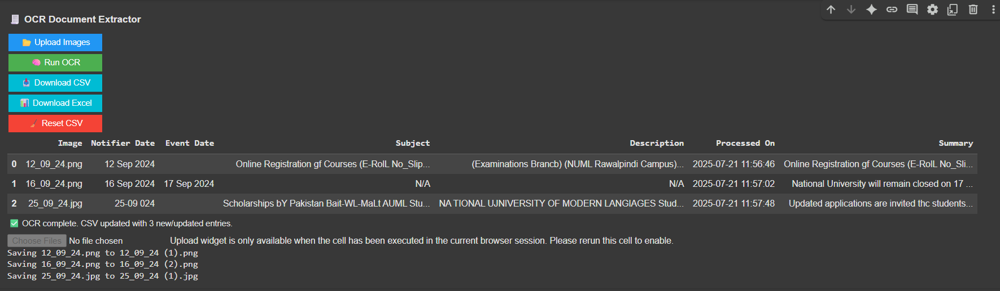

# 🧾 OCR Document Extractor with Summarization

An interactive OCR-based document parser built in **Google Colab** that allows users to upload scanned documents or image files, extract meaningful information using **EasyOCR**, generate AI-powered summaries, and export the results in **CSV** and **Excel** formats.

---

## 📌 Features

- ✅ Upload scanned images or document screenshots
- ✅ Automatically extract:
  - Notifier Date
  - Event Date
  - Subject
  - Description
  - **AI-generated Summary**
- ✅ Preview uploaded image before processing
- ✅ Duplicate detection using normalized filenames
- ✅ Clean, GUI-based interface with buttons using `ipywidgets`
- ✅ Export results to **CSV** and **Excel (.xlsx)**
- ✅ One-click reset for all saved results

---

## 🚀 Demo

🎬 Watch the video demo on [YouTube – NainaHub](https://youtu.be/0H7kkmY1gOQ?si=u9L7p5Rxh8WGoiy6)

  

---

## 📁 Project Files

| File                        | Description                                           |
|-----------------------------|-------------------------------------------------------|
| `OCR_extractor.ipynb`       | The main notebook with full logic, GUI, and summarizer |
| `ocr_extracted_results.csv` | Auto-generated CSV with OCR results                   |
| `ocr_extracted_results.xlsx`| Auto-generated Excel file from OCR results            |
| `README.md`                 | This project documentation file                       |
| `Preview.png`               | Screenshot preview of the output                        |
| `LICENSE`		      | MIT License file

---

## 🧠 Tech Stack

- **Python**
- [EasyOCR](https://github.com/JaidedAI/EasyOCR)
- [FuzzyWuzzy](https://github.com/seatgeek/fuzzywuzzy)
- [PyTorch](https://pytorch.org/)
- `re`, `pandas`, `ipywidgets`, `IPython.display`, `datetime`
- AI-based summarization (basic extractive logic)

---

## 📝 How to Use

1. Open the notebook in **Google Colab**
2. Click **📂 Upload Images** to upload notice or memo scans
3. Click **🧠 Run OCR** to extract key fields and generate a summary
4. Click **📥 Download CSV** or **📊 Download Excel** to save your data
5. Click **🧹 Reset CSV** to clear all stored OCR data

---

## 🧪 Example Output

| Image        | Notifier Date | Event Date | Subject         | Summary                        |
|--------------|----------------|------------|------------------|--------------------------------|
| notice1.png  | 10 Aug 2024    | 12 Aug 2024| Team Meeting     | A team meeting is scheduled... |
| notice2.jpg  | 15 Sep 2024    | 20 Sep 2024| Conference Invite| Invitation to a tech event...  |

---

## 🔗 Open in Colab

📎 [Click here to run in Google Colab][Open in Google Colab](https://colab.research.google.com/github/your-username/your-repo-name/blob/main/OCR-extractor.ipynb)

---

## 📬 Contact

For queries, suggestions, or feedback:

- 💼 GitHub: [@ZainabKhalid](https://github.com/ZainaKhalid)
- 📺 YouTube: [NainaHub](https://www.youtube.com/@NainaHub)

---

## 🪪 License

This project is licensed under the **MIT License**.
